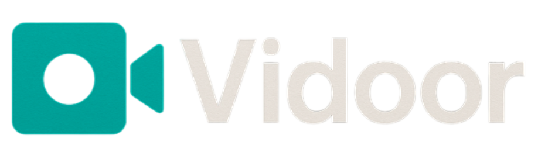

<p align="center">
    <picture>
        
    </picture>
</p>

# Vidoor

A Video Chat Application Built with Node.js, Express, Socket.io, and PeerJS

## Features

- **Real-time Video Chat**: Connect with others in private video chat rooms.
- **Unique Room Links**: Each session has a unique URL for easy sharing and joining.
- **Peer-to-Peer Media**: Uses WebRTC via PeerJS for direct video/audio streaming between users.
- **Mute/Unmute & Video On/Off**: Toggle your microphone and camera during a call.
- **Invite Others**: Share your room link to invite others to join your video chat.

## Prerequisites

- [Node.js](https://nodejs.org/) (v14 or higher recommended)
- [npm](https://www.npmjs.com/)

## Getting Started

### 1. Clone the Repository

```bash
git clone https://github.com/Rayiumir/Vidoor.git
cd Vidoor/
```

### 2. Install Dependencies

```bash
npm install
```

#### Using the PeerJS CLI (Recommended for Development)

First, install PeerJS globally if you haven't already:

```bash
npm install -g peer
```

Then start the PeerJS server (default port 3001):

```bash
peerjs --port 3001
```

### 3. Start the Application

In a new terminal, run:

```bash
npm run dev
```

The server will start on [http://localhost:3000](http://localhost:3000).

### 5. Open in Browser

Visit [http://localhost:3000](http://localhost:3000). You will be redirected to a unique room URL. Share this URL with others to invite them to your video chat room.

# Demo

https://github.com/user-attachments/assets/29d59a07-03d4-47b2-b903-fed00699a027

## How It Works

- When you visit the app, you are redirected to a unique room (UUID-based URL).
- The server uses Express for routing and EJS for templating.
- Socket.io manages real-time signaling for joining/leaving rooms.
- PeerJS handles peer-to-peer video/audio streaming between users.
- The client (`public/script.js`) manages media devices, UI controls, and PeerJS connections.

## Troubleshooting

- **PeerJS server not running**: Make sure you have started the PeerJS server on port 3001 before using the app.
- **Camera/Microphone not working**: Ensure your browser has permission to access your camera and microphone.
- **Firewall/Network issues**: Peer-to-peer connections may be blocked by strict firewalls or NAT. Try using a TURN server for better connectivity in production.

## Credits

- [PeerJS](https://peerjs.com/)
- [Socket.io](https://socket.io/)
- [Express](https://expressjs.com/)
- [uuid](https://www.npmjs.com/package/uuid)
